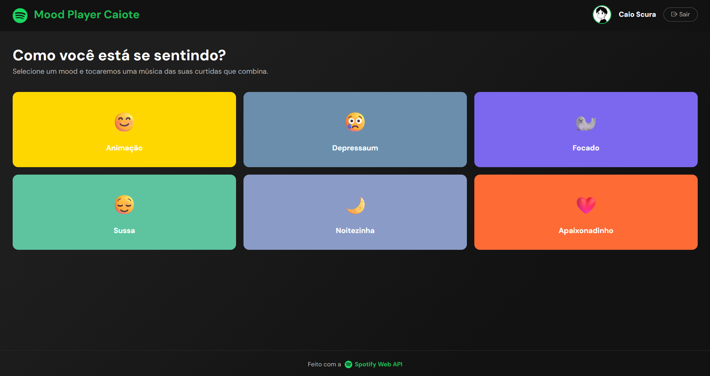
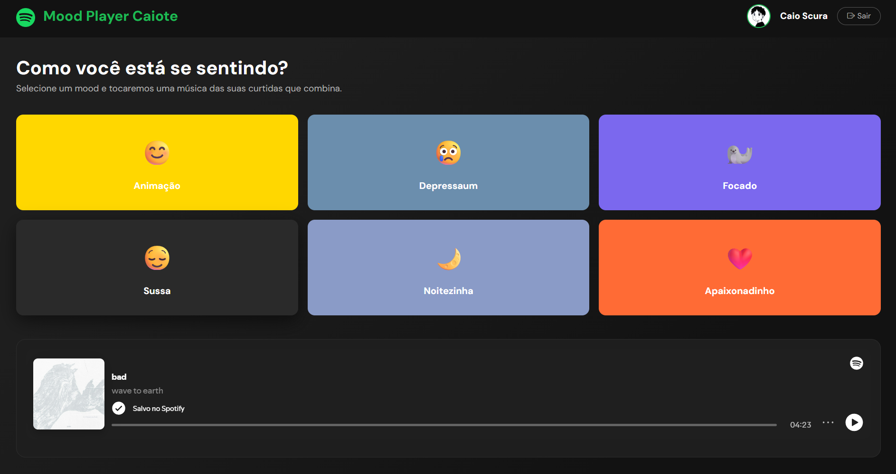

# 🎵 Mood Player - Spotify API

Um projeto web desenvolvido com **Laravel**, **Bootstrap** e a **API do Spotify**, com o objetivo de proporcionar uma experiência musical personalizada baseada no humor (mood) do usuário.

A aplicação permite explorar músicas, playlists e recomendações de acordo com diferentes estados emocionais, tornando a descoberta musical mais intuitiva e divertida.

---

## 📸 Demonstração

### 🏠 Tela inicial

<p align="center">
  
</p>

### 🎵 Exploração musical

<p align="center">
  
</p>

### 🎥 Vídeo demonstrativo

> O GitHub não reproduz vídeos `.mp4` diretamente no README.

📎 Faça o upload do vídeo em outra plataforma e adicione o link:

[▶️ Assistir demonstração do Mood Player](LINK_DO_VIDEO)

---

## 📋 Sobre o projeto

O **Mood Player** é uma aplicação que utiliza a API oficial do Spotify para conectar usuários a playlists e músicas relacionadas ao seu humor atual.

A proposta é oferecer uma interface simples, moderna e responsiva, permitindo que o usuário selecione um sentimento e receba recomendações musicais personalizadas.

---

## ✨ Funcionalidades

* 🎧 Integração com a API do Spotify
* 😊 Seleção de humor
* 🎵 Recomendação de músicas e playlists
* 🔎 Busca de artistas, álbuns e músicas
* 📱 Interface responsiva
* 🎨 Design moderno utilizando Bootstrap
* 🔐 Autenticação via Spotify

---

## 🛠️ Tecnologias utilizadas

### Backend

* PHP
* Laravel

### Frontend

* Bootstrap
* HTML5
* CSS3
* JavaScript

### API

* Spotify Web API

### Ferramentas

* Composer
* Git
* GitHub

---

## 🚀 Como executar o projeto

### 1. Clone o repositório

```bash
git clone https://github.com/CaioScura/API_Spotify.git
```

### 2. Acesse a pasta do projeto

```bash
cd API_Spotify
```

### 3. Instale as dependências

```bash
composer install
```

### 4. Configure as credenciais da API do Spotify

No arquivo `.env`, adicione:

Necessário acessar Spotify for Developers em: https://developer.spotify.com e criar um app

```env
SPOTIFY_CLIENT_ID=
SPOTIFY_CLIENT_SECRET=
SPOTIFY_REDIRECT_URI=
```

### 5. Execute o projeto

```bash
php artisan serve
```

A aplicação estará disponível em:

```text
http://localhost:8000
```

---

## 🎯 Objetivo do projeto

Este projeto foi desenvolvido com o objetivo de praticar e aprimorar conhecimentos em:

* Integração com APIs REST
* Desenvolvimento backend com Laravel
* Construção de interfaces responsivas com Bootstrap
* Manipulação de dados externos
* Boas práticas de desenvolvimento web
